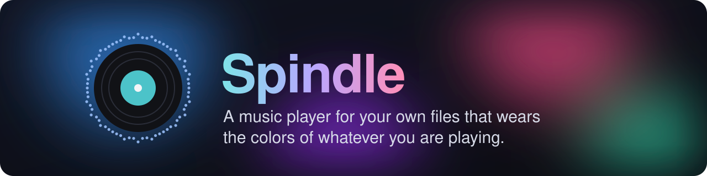
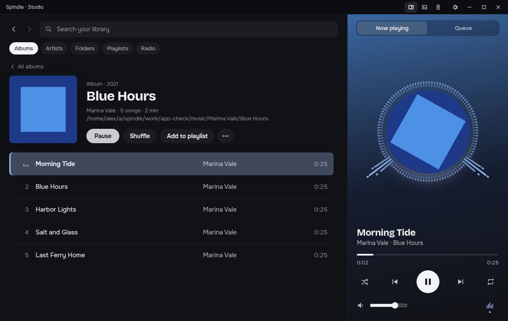
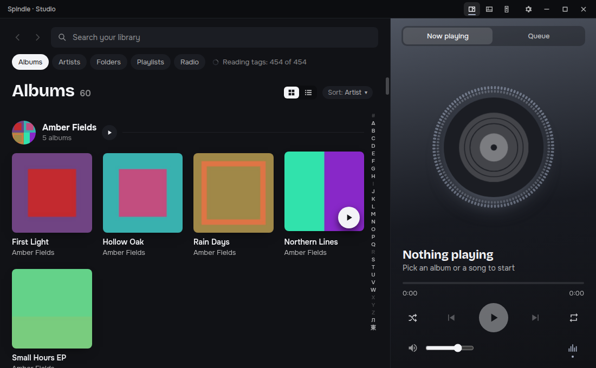
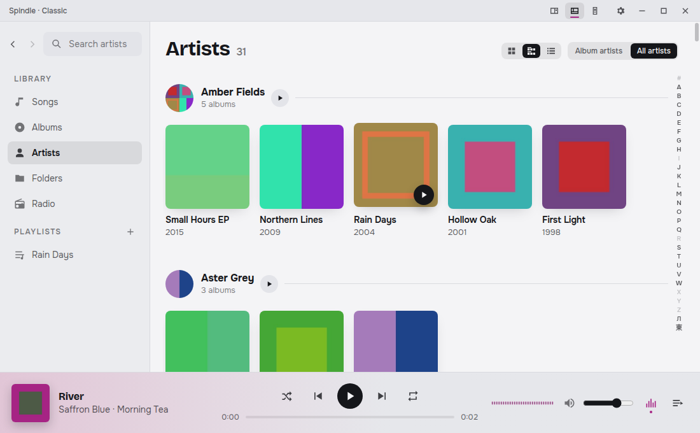
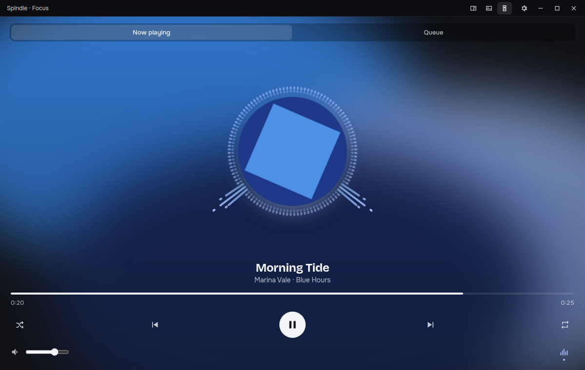
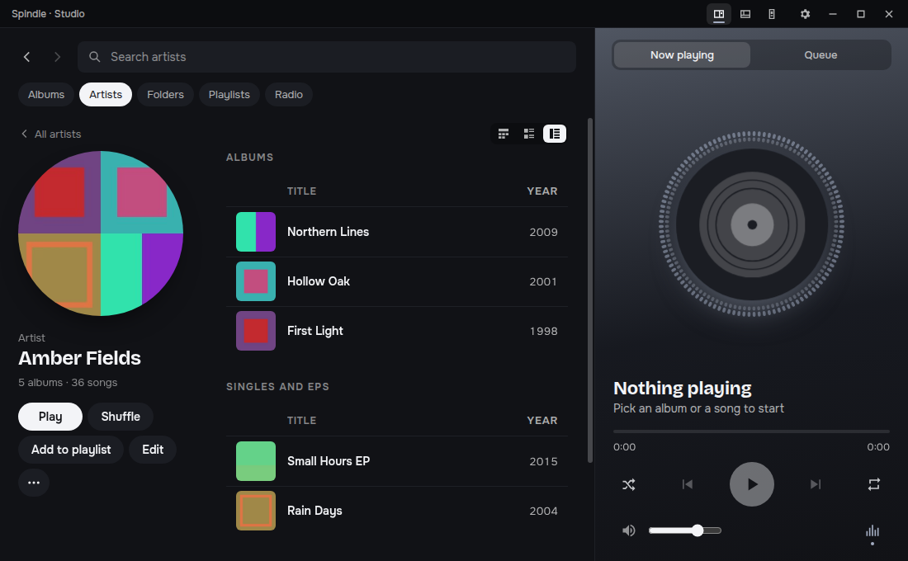
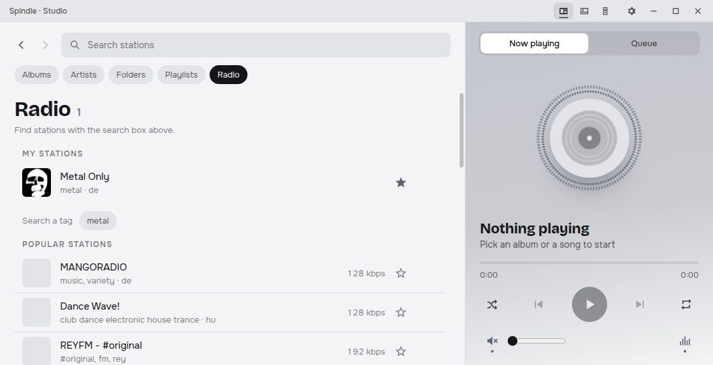

<p align="center">
  
</p>

<p align="center">
  <a href="LICENSE"></a>
  
  
  <br>
  
  
  
  
</p>

<p align="center">
  <a href="#-what-it-does">What it does</a> ·
  <a href="#-screenshots">Screenshots</a> ·
  <a href="#-run-it">Run it</a> ·
  <a href="#-license">License</a>
</p>

---

Spindle plays the music on your disk. Point it at your music folders and it reads the tags and covers, then fills the window with each album's colors. A visualizer moves around the cover while a song plays. You pick the layout: a roomy library, a classic sidebar and table, or just the cover and the controls.

<p align="center">
  
</p>

## ✨ What it does

<table>
<tr>
<td width="50%" valign="top">

### 🎨 Colors from the cover
Each album gets its own colors, picked from its cover when the library is scanned. The window, the title bar and the visualizer all follow the song that is playing. Dark and light themes each get their own accent, and the theme follows your system by default.

</td>
<td width="50%" valign="top">

### 🌀 A visualizer around the cover
Choose **Ring**, **Spectrum** or **Wave**, or turn it off. It listens to what actually goes to the speakers and redraws every frame without slowing the rest of the app.

</td>
</tr>
<tr>
<td valign="top">

### 🧩 Three layouts, one click away
- **Studio**: chips, a cover grid and a player column
- **Classic**: sidebar, song table and a player bar at the bottom
- **Focus**: just the cover, the visualizer and the controls

Each layout remembers its own window size. The queue can sit in a tab, a drawer or a column.

</td>
<td valign="top">

### 🎧 Plays what you have
MP3, FLAC, Ogg, Opus, AAC, M4A, WAV, plus APE, ALAC, WMA, WavPack and AIFF through a bundled ffmpeg. Disc images with a `.cue` sheet show as their tracks. Songs run into each other with **no gap**, and **ReplayGain** keeps the loudness even.

</td>
</tr>
<tr>
<td valign="top">

### 📚 Built for big libraries
Albums, Artists, Folders and Playlists views. Albums and Artists come as a grid or a list, and Artists also as shelves. Lists only draw the rows on screen, so 50,000 songs stay smooth. Scans run in the background and only read files that changed.

</td>
<td valign="top">

### 📻 Internet radio
Search thousands of stations from Radio Browser, keep your own list, and see the song name and cover as they change. Music For Programming mixes play in their own tab, split into their songs.

</td>
</tr>
<tr>
<td valign="top">

### 🖼️ Covers that find themselves
Albums with no cover of their own get one from MusicBrainz, Deezer or iTunes. Turn it off in Settings and the app sends nothing anywhere.

</td>
<td valign="top">

### ⌨️ Made for daily use
Keyboard shortcuts, multi-select, drag songs to the queue or a playlist, undo for removes, play counts and recently played, a tray icon with play controls, and mouse Back and Forward buttons.

</td>
</tr>
</table>

> [!TIP]
> Artist names spelled five different ways? Spindle can ask a language model (free models through OpenRouter) to group the spellings and split joint credits. It's off until you turn it on, and you can see and undo every change it made.

## 📸 Screenshots

<table>
<tr>
<td width="50%"><p align="center"><sub><b>Albums</b>, grouped by artist, with a letter strip to jump</sub></p></td>
<td width="50%"><p align="center"><sub><b>Classic</b> layout in the light theme</sub></p></td>
</tr>
<tr>
<td><p align="center"><sub><b>Focus</b>: the cover's colors fill the window</sub></p></td>
<td><p align="center"><sub>An <b>artist page</b> with albums, singles and EPs</sub></p></td>
</tr>
<tr>
<td colspan="2" align="center"><p align="center"><sub><b>Radio</b>: your stations, tags and popular stations</sub></p></td>
</tr>
</table>

<sub>The albums in these shots are made up and the covers are generated.</sub>

## 🧱 Under the hood

Everything except the player, the queue, playlists, Settings and the look is a **plugin**: music files, radio and Music For Programming can each be turned off. A plugin gives data and says what it can do; the core draws it. Layouts are plain data files that place the same parts. See [docs/design.md](docs/design.md) for how templates, parts and slots fit together.

| | |
|---|---|
| 🖥️ App | Electron 44, sandboxed page, all file access in the main process |
| 🎛️ UI | Svelte 5 and TypeScript, virtual lists from `@tanstack/svelte-virtual` |
| 🏷️ Tags | `music-metadata`, read in a worker thread |
| 🔊 Audio | Chromium audio plus Web Audio, ffmpeg for the formats Chromium can't play |
| ✅ Tests | Vitest |

## 🚀 Run it

> [!NOTE]
> Spindle is early (version 0.1.0) and Linux only for now. There are no ready-made downloads yet, so build it from source.

You need Node 22 or newer.

```bash
git clone https://github.com/astepanov83/spindle-player.git
cd spindle-player
npm install        # also downloads ffmpeg and ffprobe (see below)
npm run dev        # the app with hot reload
```

Then open Settings (the gear), add your music folders under **Music files**, and press play.

| Command | What it does |
|---|---|
| `npm run dev` | The app with hot reload |
| `npm run typecheck` | TypeScript and Svelte checks |
| `npm run lint` | ESLint |
| `npm test` | Unit tests (Vitest) |
| `npm run package` | AppImage and .deb in `dist/` |
| `npm run package:win` | Windows installer and .zip in `dist/` (run it on Windows) |

Releases are built on GitHub: pushing a tag `v<version>` (the version in `package.json`, such as `v0.1.0`) runs `.github/workflows/release.yml`, which builds the .deb for Linux and the installer for Windows and publishes them as that release. It can also be run by hand from the Actions tab to build the packages without publishing them.

<details>
<summary><b>About ffmpeg</b></summary>

`npm install` downloads a pinned static build of ffmpeg and ffprobe into `resources/ffmpeg/` and checks its sha256: 7.0.2 on Linux x64 (about 58 MB), or gyan.dev's 6.1.1 on Windows x64 (about 165 MB). If that fails (offline, another platform), the app still runs, but APE, ALAC, WMA, WavPack and AIFF won't play. `npm run fetch-ffmpeg` tries again; `npm run package` and `npm run package:win` stop if the binaries are missing. These downloads are for working on Spindle: released packages are built by the Release workflow (see below).

</details>

<details>
<summary><b>Ubuntu 24.04 and newer: sandbox error on <code>npm run dev</code></b></summary>

`npm run dev` may stop with `The SUID sandbox helper binary was found, but is not configured correctly`. Ubuntu blocks the user namespaces that Chromium's sandbox needs. Pick one:

```bash
# Allow them for this repo's Electron only (once per machine, keeps the sandbox)
sudo ./scripts/setup-apparmor-dev.sh

# Or run without Chromium's sandbox, dev only
npx electron-vite dev --noSandbox
```

The installed .deb sets this up by itself. The AppImage turns the sandbox off when it can't use it.

</details>

<details>
<summary><b>The prototype</b></summary>

`prototype/index.html` is the first design, with no build step and no dependencies. Open it in a browser to see the three layouts, the queue placements and the visualizer styles. "Play a song from your computer" runs the visualizer on real sound, and "Show parts" outlines each part, container and button slot.

</details>

## 📄 License

Spindle is under the [MIT](LICENSE) license.

The packaged app also ships ffmpeg and ffprobe as separate programs, which Spindle runs unmodified. They are not part of Spindle's code and are not under its MIT license: they are [FFmpeg](https://ffmpeg.org), built by the Release workflow from FFmpeg's source with only its own audio decoders and no outside libraries (`scripts/ffmpeg/build.sh`), and licensed under the GNU LGPL version 2.1 or later. In the installed app they are in `resources/app.asar.unpacked/resources/ffmpeg/`, with their license, build settings, and `SOURCE.txt`, which says where their source is.

<p align="center"><sub>Made for listening to whole albums. 💿</sub></p>
